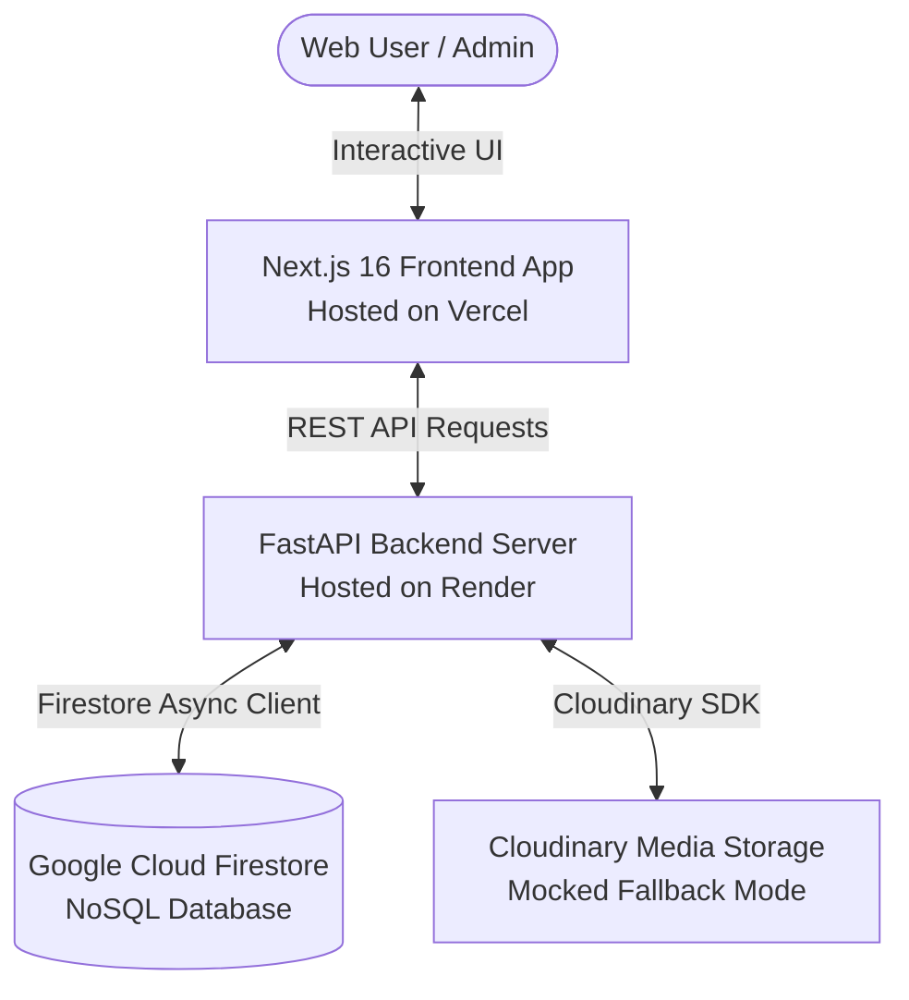
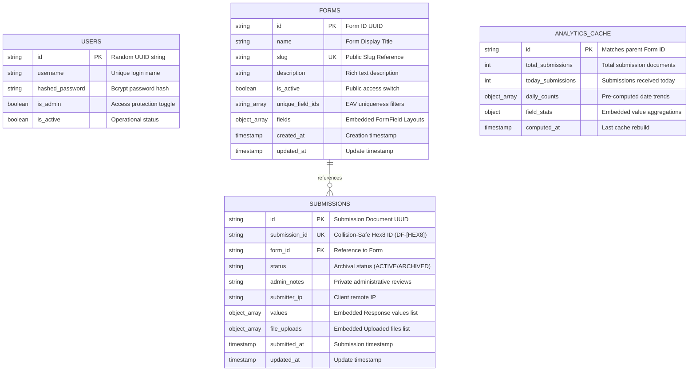
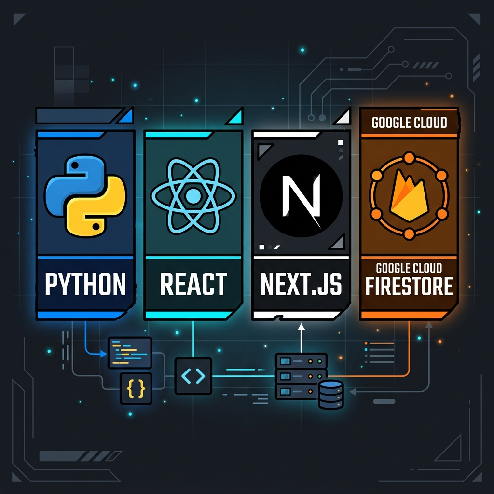

<h1 align="center">DataForge</h1>
<p align="center">
  <a href="#-tech-stack"></a>
  <a href="#-tech-stack"></a>
  <a href="#-tech-stack"></a>
  <a href="#-tech-stack"></a>
  <a href="#-tech-stack"></a>
</p>

DataForge is a premium, developer-centric, personal form builder, data collection repository, and analytics platform. It allows developers and administrators to design responsive forms via a neo-brutalist interactive builder, gather structured responses, perform collision-safe tracking, generate customized A4-ready report matrices, and display cached analytics—all backed by a serverless Firestore database.

---

## 🗺️ System Architecture Flow

DataForge separates static, client-side rendering from the core business logic. 



### Flow Breakdown:
1. **Dynamic Client Navigation**: The user designs a form layout in the **Next.js Frontend**. Any change triggers instant UI rendering.
2. **REST Endpoints**: When saving, the frontend makes authorized requests (`Bearer JWT`) to the **FastAPI Backend**.
3. **NoSQL Persistence**: The backend translates form configurations and stores them inside dedicated **Google Cloud Firestore** documents in sub-millisecond execution loops.
4. **Public Form Actions**: A public submitter fills out a form. The API validates submissions, verifies field constraints, handles unique-field duplicate checks, and updates the Firestore registry.

---

## 📊 Database Collection Models

DataForge uses Google Cloud Firestore collections. Relational joins have been replaced with embedded NoSQL documents for maximum performance.



---

## 🛠️ Tech Stack & Components

<p align="center">
  
</p>

### Frontend Features
* **Modern UI & Theme System**: Neo-brutalist custom CSS styling. Features full dark-mode support and clean component transitions using Tailwind and `@base-ui/react`.
* **Drag-and-Drop Layout Creator**: Real-time canvas for adding, ordering, and configuring form fields (text, numbers, selections, checkboxes, file uploads).
* **A4 Report Customizer**: Interactive report builder designed for generating physical documents. Features page size control, margin optimization, font formatting, custom empty signature columns, and print styles (`@media print`).
* **Live Dashboards & Recharts**: Visual graphs showing submissions over time, choice distributions, and response metrics.

### Backend Features
* **Async Firestore Integration**: Uses python's `google-cloud-firestore` AsyncClient. 
* **Collision-Safe Submission Tracking**: Generates readable submission reference keys (e.g. `DF-A4B7D2EF`) using a checked random hex loop that guarantees uniqueness under concurrent requests.
* **Aggregated Caching**: Periodically updates and writes statistics to an `analytics_cache` collection, allowing instant dashboard loading without scanning thousands of records.
* **Robust Startup Lifecycle**: Implements a non-fatal lifespan database seeder that falls back gracefully if connection keys are not initialized.

---

## 🚀 Beginner-Friendly Setup

### Prerequisites
Make sure you have the following installed on your machine:
* [Python 3.12](https://www.python.org/downloads/)
* [Node.js (v18 or newer)](https://nodejs.org/)
* [Git](https://git-scm.com/)

---

### Local Installation (Without Docker)

#### 1. Clone the Codebase
```bash
git clone https://github.com/devvikax/DataForge.git
cd DataForge
```

#### 2. Configure Local Environment Files
Copy the template files to configure your environment variables:
```bash
# Copy root variables
cp .env.example .env

# Copy backend variables
cp backend/.env.example backend/.env

# Copy frontend variables
cp frontend/.env.example frontend/.env.local
```

#### 3. Setup the Backend API Server
Navigate to the `backend/` directory, create a virtual python environment, install packages, and boot the server:
```bash
cd backend
python -m venv venv

# Activate Virtual Environment:
# On Windows:
venv\Scripts\activate
# On macOS/Linux:
source venv/bin/activate

# Install requirements
pip install -r requirements.txt

# Run Uvicorn Development Server
uvicorn app.main:app --host 127.0.0.1 --port 8000 --reload
```
*The backend API will now be running at **http://127.0.0.1:8000**.*

#### 4. Setup the Frontend App
Open a new terminal window, navigate to the `frontend/` directory, install packages, and launch:
```bash
cd frontend
npm install
npm run dev
```
*The web interface will now be running at **http://localhost:3000**.*

---

## 🐳 Docker Compose Quickstart

If you have Docker installed, you can launch both the frontend and backend simultaneously:

```bash
# Build and launch all containers
docker-compose up --build
```
* **Frontend Site**: http://localhost:3000
* **Backend API Docs**: http://localhost:8000/docs

---

## 🌍 Production Deployment

### 1. Backend (Render)
1. Set up a new **Web Service** pointing to the `backend` folder.
2. Select the **Docker** runtime.
3. In **Settings > Environment**, add your environment variables (`SECRET_KEY`, `FIREBASE_PROJECT_ID`, etc.).
4. Add your Firebase service account JSON credentials as a **Secret File**:
   * Filename: `firebase-service-account.json`
   * Contents: (Paste your entire Firebase SDK service account JSON)
5. Configure `FIREBASE_CREDENTIALS_PATH` in Render to: `/etc/secrets/firebase-service-account.json`.

### 2. Frontend (Vercel)
1. Set up a new project on **Vercel**.
2. Select `frontend` as the **Root Directory**.
3. In the project settings, make sure the **Output Directory** is set to default (`.next`), and the Build Command is `next build`.
4. Add the environment variable:
   * `NEXT_PUBLIC_API_URL`: Your deployed Render API URL (e.g. `https://your-backend.onrender.com`).
5. Deploy.
